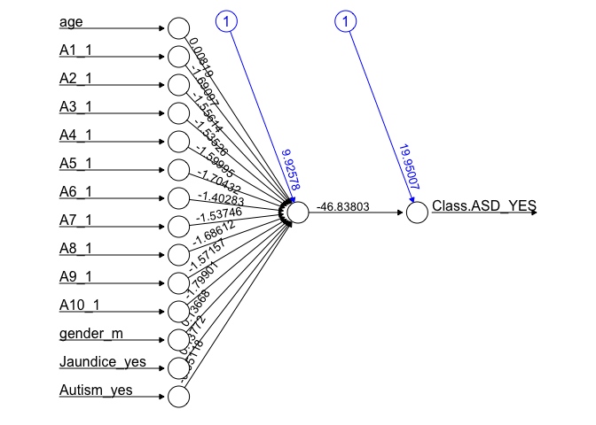
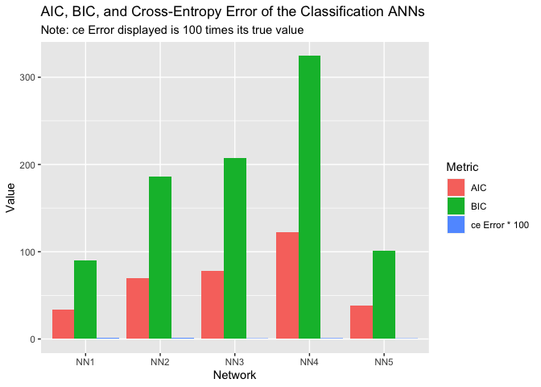
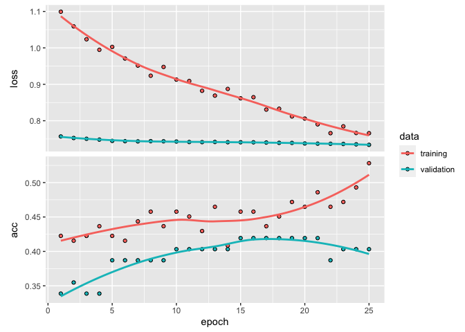
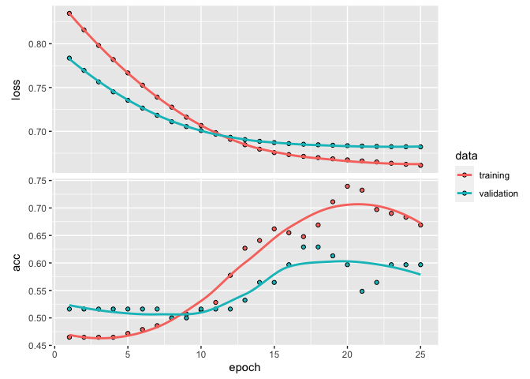
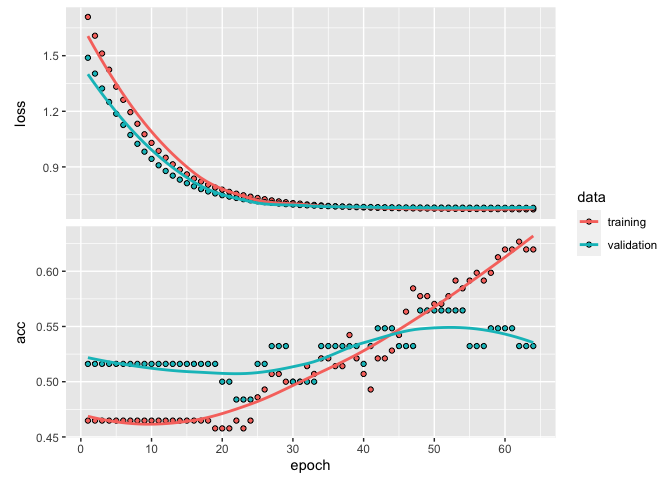

Predicting ASD with Neural Network
================

Deep learning provides a multi-layer approach to learn data
representations, typically performed with a multi-layer neural network.
Like other machine learning algorithms, deep neural networks (DNN)
perform learning by mapping features to targets through a process of
simple data transformations and feedback signals; however, DNNs place an
emphasis on learning successive layers of meaningful representations.

The ANN was constructed using the ‘neural net’ library, which outputs
the probability of each observation belonging to each class of ASD. This
library’s ‘neural net’ function assigns random initial weight values to
each variable. It requires the use of the ‘Cross-Entropy’ error – an
equivalent measure of the differences between the predicted and observed
outcome for each observation in the dataset – for the performance
measure. Therefore, we can only change the structure of the network by
varying the structure of the hidden layers that stand in between the
input layer (i.e., which receives the raw data) and the output layer
(i.e., which produces the probabilities of each class) as well as the
number of neurons (i.e., interconnected processing units of
information).

``` r
library(tidyverse)
```

    ## ── Attaching packages ─────────────────────────────────────── tidyverse 1.3.1 ──

    ## ✓ ggplot2 3.3.4     ✓ purrr   0.3.4
    ## ✓ tibble  3.1.2     ✓ dplyr   1.0.8
    ## ✓ tidyr   1.1.3     ✓ stringr 1.4.0
    ## ✓ readr   2.1.2     ✓ forcats 0.5.1

    ## Warning: package 'readr' was built under R version 4.1.2

    ## Warning: package 'dplyr' was built under R version 4.1.2

    ## ── Conflicts ────────────────────────────────────────── tidyverse_conflicts() ──
    ## x dplyr::filter() masks stats::filter()
    ## x dplyr::lag()    masks stats::lag()

``` r
library(neuralnet)
```

    ## 
    ## Attaching package: 'neuralnet'

    ## The following object is masked from 'package:dplyr':
    ## 
    ##     compute

``` r
library(GGally)
```

    ## Registered S3 method overwritten by 'GGally':
    ##   method from   
    ##   +.gg   ggplot2

# Loading the dataset

``` r
# loading the data and removing missing values
library(foreign)
data = read.arff("Autism-Child-Data.arff")
data = data.frame(data)

# removing unnecessary variables
data$age_desc = NULL
data$result = NULL
data$contry_of_res = NULL
data$relation = NULL
data$used_app_before = NULL
data$ethnicity = NULL


# checking the data
dim(data)
```

    ## [1] 292  15

``` r
names(data)
```

    ##  [1] "A1_Score"  "A2_Score"  "A3_Score"  "A4_Score"  "A5_Score"  "A6_Score" 
    ##  [7] "A7_Score"  "A8_Score"  "A9_Score"  "A10_Score" "age"       "gender"   
    ## [13] "jundice"   "austim"    "Class.ASD"

# Pre-processing

Before performing the classification artificial neural network (ANN),
categorical variables were first one-hot-encoded. The data were
normalized using the min-max normalization technique to remove the
scaling effect from all the variables to minimise the variable
prediction.

``` r
# renaming variables
names(data)[1:10] <- c("A1", "A2", "A3", "A4", "A5", "A6", "A7", "A8", "A9", "A10")
names(data)[13] <- "Jaundice"
names(data)[14] <-  "Autism"

# converting to numerical variables 
library(fastDummies)
df <- dummy_cols(data,select_columns = c('A1', 'A2', 'A3','A4', 'A5', 'A6','A7', 'A8','A9', 'A10', 'gender', 'Jaundice','Autism', 'Class.ASD'), remove_selected_columns = TRUE, remove_first_dummy = TRUE )

# All categorical variables except for age

scale01 <- function(x){
  (x - min(x)) / (max(x) - min(x))
}

for (i in 1:ncol(df)) {
  df[is.na(df[, i]), i] <- mean(df[, i], na.rm = TRUE)
  
}

df$age <- round(df$age)

sum(is.na(df))
```

    ## [1] 0

``` r
str(df)
```

    ## 'data.frame':    292 obs. of  15 variables:
    ##  $ age          : num  6 6 6 5 5 4 5 5 11 11 ...
    ##  $ A1_1         : int  1 1 1 0 1 0 1 1 1 0 ...
    ##  $ A2_1         : int  1 1 1 1 1 0 0 1 1 0 ...
    ##  $ A3_1         : int  0 0 0 0 1 1 1 1 1 1 ...
    ##  $ A4_1         : int  0 0 0 0 1 0 1 1 1 1 ...
    ##  $ A5_1         : int  1 1 0 1 1 1 1 1 1 1 ...
    ##  $ A6_1         : int  1 1 1 1 1 1 1 1 1 0 ...
    ##  $ A7_1         : int  0 0 1 0 1 0 0 1 1 1 ...
    ##  $ A8_1         : int  1 1 1 0 1 1 1 1 0 1 ...
    ##  $ A9_1         : int  0 0 0 0 1 0 0 0 0 0 ...
    ##  $ A10_1        : int  0 0 0 1 1 1 1 0 0 0 ...
    ##  $ gender_m     : int  1 1 1 0 1 1 1 0 0 0 ...
    ##  $ Jaundice_yes : int  0 0 0 1 1 0 0 0 0 0 ...
    ##  $ Autism_yes   : int  0 0 0 0 0 1 0 0 0 1 ...
    ##  $ Class.ASD_YES: int  0 0 0 0 1 0 1 1 1 0 ...

# Data Partitioning

``` r
# Reproducibility
set.seed(123)
# Splitting the data set (70% for training, 30% for testing)

train_index = sample(1:nrow(df), 204)
data_train = df[train_index, ]
data_test = df[-train_index, ]
```

# 1st Classification ANN

The ANNs were constructed using only two hidden layers with either one
or two neurons for each layer, considering the feature space size. The
most efficient network was chosen based on Akaike’s Information Criteria
(AIC) and Bayesian Information Criteria (BIC).

We construct a 1-hidden layer ANN with 1 neuron. The `neuralnet` package
defaults to random initial weight values, for reproducibility we set a
seed and construct the network. We have added three additional arguments
for the classification ANN using the neuralnet package, `linear.output`,
`err.fct`, and `likelihood`.

-   Setting the `linear.output` to `FALSE` and the `err.fct` to “ce”
    indicates that we are performing a classification, and forces the
    model to output what we may interpret as a probability of each
    observation belonging to `ASD` class 1 = YES.

-   For classification ANN the cross-entropy error metric is more
    appropriate than the SSE used in regression ANNs. The `likelihood`
    argument set to `TRUE` indicates to neuralnet that we would like to
    see the AIC and BIC metrics.

-   The threshold is set to 0.01, meaning that if the change in error
    during an iteration is less than 1%, then no further optimization
    will be carried out by the model

``` r
set.seed(123)

asd_NN1 <- neuralnet(Class.ASD_YES ~ ., data = data_train, 
                     linear.output = FALSE,
                     err.fct = 'ce',
                     likelihood = TRUE,
                     )

plot(asd_NN1, rep = 'best')
```

<!-- -->

The asd\_NN1 is a list containing all parameters of the classification
ANN as well as the results of the neural network on the train data set.
To view the `asd_NN1`, AIC, BIC, and error metrics run the following.

``` r
asd_NN1_train_error <- asd_NN1$result.matrix[1,1]
paste("CE Error: ", round(asd_NN1_train_error, 3))
```

    ## [1] "CE Error:  0.01"

``` r
asd_NN1_AIC <- asd_NN1$result.matrix[4, 1]
paste("AIC: ", round(asd_NN1_AIC, 3))
```

    ## [1] "AIC:  34.02"

``` r
asd_NN1_BIC <- asd_NN1$result.matrix[5, 1]
paste("BIC: ", round(asd_NN1_BIC, 3))
```

    ## [1] "BIC:  90.428"

The error displayed in this plot is the cross-entropy error, which is a
measure of the differences between the predicted and observed output for
each of the observations in the `ASD` data set.

# Classification Hyperparameters

Classification ANNs within the neuralnet package require the use of the
ce error. This forces us into using the default act.fun hyperparameter
value. As a result we will only change the structure of the
classification ANNs using the hidden function setting.

``` r
set.seed(123)
#  2-Hidden Layers, Layer-1 2-neurons, Layer-2, 1-neuron
asd_NN2 <- neuralnet(Class.ASD_YES ~ ., data = data_train, 
                     linear.output = FALSE,
                     err.fct = 'ce',
                     likelihood = TRUE,
                     hidden = c(2, 1),
                     )

asd_NN2_train_error <- asd_NN2$result.matrix[1,1]
paste("CE Error: ", round(asd_NN2_train_error, 3))
```

    ## [1] "CE Error:  0.014"

``` r
asd_NN2_AIC <- asd_NN2$result.matrix[4, 1]
paste("AIC: ", round(asd_NN2_AIC, 3))
```

    ## [1] "AIC:  70.029"

``` r
asd_NN2_BIC <- asd_NN2$result.matrix[5, 1]
paste("BIC: ", round(asd_NN2_BIC, 3))
```

    ## [1] "BIC:  186.163"

``` r
set.seed(123)
#  2-Hidden Layers, Layer-1 2-neurons, Layer-2, 2-neuron
asd_NN3 <- neuralnet(Class.ASD_YES ~ ., data = data_train, 
                     linear.output = FALSE,
                     err.fct = 'ce',
                     likelihood = TRUE,
                     hidden = c(2, 2),
                     )
asd_NN3_train_error <- asd_NN3$result.matrix[1,1]
paste("CE Error: ", round(asd_NN3_train_error, 3))
```

    ## [1] "CE Error:  0.004"

``` r
asd_NN3_AIC <- asd_NN3$result.matrix[4, 1]
paste("AIC: ", round(asd_NN3_AIC, 3))
```

    ## [1] "AIC:  78.008"

``` r
asd_NN3_BIC <- asd_NN3$result.matrix[5, 1]
paste("BIC: ", round(asd_NN3_BIC, 3))
```

    ## [1] "BIC:  207.415"

``` r
set.seed(123)
#  2-Hidden Layers, Layer-1 1-neurons, Layer-2, 2-neuron
asd_NN4 <- neuralnet(Class.ASD_YES ~ ., data = data_train, 
                     linear.output = FALSE,
                     err.fct = 'ce',
                     likelihood = TRUE,
                     hidden = c(3, 3), 
                     )

asd_NN4_train_error <- asd_NN4$result.matrix[1,1]
paste("CE Error: ", round(asd_NN4_train_error, 3))
```

    ## [1] "CE Error:  0.006"

``` r
asd_NN4_AIC <- asd_NN4$result.matrix[4, 1]
paste("AIC: ", round(asd_NN4_AIC, 3))
```

    ## [1] "AIC:  122.012"

``` r
asd_NN4_BIC <- asd_NN4$result.matrix[5, 1]
paste("BIC: ", round(asd_NN4_BIC, 3))
```

    ## [1] "BIC:  324.417"

``` r
set.seed(123)

#  2-Hidden Layers, Layer-1 1-neurons, Layer-2, 1-neuron
asd_NN5 <- neuralnet(Class.ASD_YES ~ ., data = data_train, 
                     linear.output = FALSE,
                     err.fct = 'ce',
                     likelihood = TRUE,
                     hidden = c(1, 1), 
                     )
asd_NN5_train_error <- asd_NN5$result.matrix[1,1]
paste("CE Error: ", round(asd_NN5_train_error, 3))
```

    ## [1] "CE Error:  0.003"

``` r
asd_NN5_AIC <- asd_NN5$result.matrix[4, 1]
paste("AIC: ", round(asd_NN5_AIC, 3))
```

    ## [1] "AIC:  38.007"

``` r
asd_NN5_BIC <- asd_NN5$result.matrix[5, 1]
paste("BIC: ", round(asd_NN5_BIC, 3))
```

    ## [1] "BIC:  101.051"

``` r
# Bar plot of results
Class_NN_ICs <- tibble('Network' = rep(c("NN1", "NN2", "NN3", "NN4", "NN5"), each = 3), 
                       'Metric' = rep(c('AIC', 'BIC', 'ce Error * 100'), length.out = 15),
                       'Value' = c(asd_NN1$result.matrix[4,1], asd_NN1$result.matrix[5,1], 
                                   100*asd_NN1$result.matrix[1,1], asd_NN2$result.matrix[4,1], 
                                   asd_NN2$result.matrix[5,1], 100*asd_NN2$result.matrix[1,1],
                                   asd_NN3$result.matrix[4,1], asd_NN3$result.matrix[5,1], 
                                   100*asd_NN3$result.matrix[1,1], asd_NN4$result.matrix[4,1], 
                                   asd_NN4$result.matrix[5,1], 100*asd_NN4$result.matrix[1,1],
                                   asd_NN5$result.matrix[4,1], asd_NN5$result.matrix[5,1], 
                                   100*asd_NN5$result.matrix[1,1]))


ggneural <- Class_NN_ICs %>%
  ggplot(aes(Network, Value, fill = Metric)) +
  geom_col(position = 'dodge')  +
  ggtitle("AIC, BIC, and Cross-Entropy Error of the Classification ANNs", "Note: ce Error displayed is 100 times its true value")
ggneural
```

<!-- -->
The plot indicates that as we add hidden layers and nodes within those
layers, our AIC and cross-entropy error grows. The BIC appears to remain
relatively constant across the designs. Here NN4/NN1 seems to be the
relatively the best model here.

# Testing the accuracy of the Model

As already mentioned, our neural network has been created using the
training data. We then compare this to the test data to gauge the
accuracy of the neural network forecast.

In the below:

-   The “subset” function is used to eliminate the dependent variable
    from the test data
-   The “compute” function then creates the prediction variable
-   A “results” variable then compares the predicted data with the
    actual data
-   A confusion matrix is then created with the table function to
    compare the number of true/false positives and negatives

``` r
#Test the resulting output

asd_NN1.results <- compute(asd_NN1, data_test[, c(1:14)])
results <- data.frame(actual = data_test$Class.ASD_YES, prediction = round(asd_NN1.results$net.result))
print(head(results))
```

    ##    actual prediction
    ## 2       0          0
    ## 3       0          0
    ## 8       1          1
    ## 12      0          0
    ## 15      1          1
    ## 18      0          0

``` r
asd_NN3.results <- compute(asd_NN3, data_test[, c(1:14)])
results3 <- data.frame(actual = data_test$Class.ASD_YES, prediction = round(asd_NN3.results$net.result))
print(head(results3))
```

    ##    actual prediction
    ## 2       0          0
    ## 3       0          0
    ## 8       1          1
    ## 12      0          0
    ## 15      1          1
    ## 18      0          0

``` r
asd_NN4.results <- compute(asd_NN4, data_test[, c(1:14)])
results4 <- data.frame(actual = data_test$Class.ASD_YES, prediction = round(asd_NN4.results$net.result))
print(head(results4))
```

    ##    actual prediction
    ## 2       0          0
    ## 3       0          0
    ## 8       1          1
    ## 12      0          0
    ## 15      1          1
    ## 18      0          0

``` r
asd_NN5.results <- compute(asd_NN5, data_test[, c(1:14)])
results5 <- data.frame(actual = data_test$Class.ASD_YES, prediction = round(asd_NN5.results$net.result))
print(head(results5))
```

    ##    actual prediction
    ## 2       0          0
    ## 3       0          0
    ## 8       1          1
    ## 12      0          0
    ## 15      1          1
    ## 18      0          0

The predicted results are compared to the actual results as above.

# Confusion Matrix

Then, we round up our results using sapply and create a confusion matrix
to compare the number of true/false positives and negatives:

``` r
# NN1
roundedresults1<-sapply(results,round,digits=0)
roundedresultsdf1=data.frame(roundedresults1)
attach(roundedresultsdf1)
table(actual,prediction)
```

    ##       prediction
    ## actual  0  1
    ##      0 53  0
    ##      1  0 35

``` r
# NN4
roundedresults4<-sapply(results4,round,digits=0)
roundedresultsdf4=data.frame(roundedresults4)
attach(roundedresultsdf4)
```

    ## The following objects are masked from roundedresultsdf1:
    ## 
    ##     actual, prediction

``` r
table(actual,prediction)
```

    ##       prediction
    ## actual  0  1
    ##      0 52  1
    ##      1  1 34

``` r
# NN5
roundedresults5<-sapply(results5,round,digits=0)
roundedresultsdf5=data.frame(roundedresults5)
attach(roundedresultsdf5)
```

    ## The following objects are masked from roundedresultsdf4:
    ## 
    ##     actual, prediction
    ## 
    ## The following objects are masked from roundedresultsdf1:
    ## 
    ##     actual, prediction

``` r
table(actual,prediction)
```

    ##       prediction
    ## actual  0  1
    ##      0 53  0
    ##      1  0 35

# Fitting DNN using Keras

``` r
library(keras)        
library(tfruns) 

model <- keras_model_sequential() %>% 
  layer_dense(units = 4, input_shape = 14, activation = "relu",
              kernel_regularizer = regularizer_l2(0.001)) %>%
  layer_batch_normalization() %>% 
  layer_dense(units = 4,  activation = "relu",
              kernel_regularizer = regularizer_l2(0.001)) %>% 
  layer_batch_normalization() %>% 
  layer_dense(units = 1, activation = "sigmoid") %>% 
  
  compile(
    optimizer = optimizer_rmsprop(),
    loss = "binary_crossentropy",
    metrics = c("accuracy")
  )
```

    ## Loaded Tensorflow version 1.14.0

``` r
model %>% summary()
```

    ## Model: "sequential"
    ## ________________________________________________________________________________
    ## Layer (type)                        Output Shape                    Param #     
    ## ================================================================================
    ## dense_2 (Dense)                     (None, 4)                       60          
    ## ________________________________________________________________________________
    ## batch_normalization_1 (BatchNormali (None, 4)                       16          
    ## ________________________________________________________________________________
    ## dense_1 (Dense)                     (None, 4)                       20          
    ## ________________________________________________________________________________
    ## batch_normalization (BatchNormaliza (None, 4)                       16          
    ## ________________________________________________________________________________
    ## dense (Dense)                       (None, 1)                       5           
    ## ================================================================================
    ## Total params: 117
    ## Trainable params: 101
    ## Non-trainable params: 16
    ## ________________________________________________________________________________

``` r
train_x = data_train[, c(1:14)]
train_y = data_train[, 15]

fit1 <- model %>% fit(
  x = as.matrix(train_x),
  y = as.matrix(train_y),
  epochs = 25,
  batch_size = 64,
  validation_split = 0.3,
  verbose = FALSE
)

fit1
```

    ## Trained on 142 samples (batch_size=64, epochs=25)
    ## Final epoch (plot to see history):
    ##     loss: 0.7658
    ##      acc: 0.5282
    ## val_loss: 0.7339
    ##  val_acc: 0.4032

``` r
plot(fit1)
```

    ## `geom_smooth()` using formula 'y ~ x'

<!-- -->

``` r
# baseline model
set.seed(123)
baseline_model <- 
  keras_model_sequential() %>%
  layer_dense(units = 16, activation = "relu", input_shape = 14) %>%
  layer_dense(units = 8, activation = "relu") %>%
  layer_dense(units = 1, activation = "sigmoid")

baseline_model %>% compile(
  optimizer = "adam",
  loss = "binary_crossentropy",
  metrics = list("accuracy")
)

baseline_model %>% summary()
```

    ## Model: "sequential_1"
    ## ________________________________________________________________________________
    ## Layer (type)                        Output Shape                    Param #     
    ## ================================================================================
    ## dense_5 (Dense)                     (None, 16)                      240         
    ## ________________________________________________________________________________
    ## dense_4 (Dense)                     (None, 8)                       136         
    ## ________________________________________________________________________________
    ## dense_3 (Dense)                     (None, 1)                       9           
    ## ================================================================================
    ## Total params: 385
    ## Trainable params: 385
    ## Non-trainable params: 0
    ## ________________________________________________________________________________

``` r
baseline_history <- baseline_model %>% fit(
  as.matrix(train_x),
  as.matrix(train_y),
  epochs = 25,
  batch_size = 128,
  validation_split = 0.3,
  verbose = FALSE
)
baseline_history
```

    ## Trained on 142 samples (batch_size=128, epochs=25)
    ## Final epoch (plot to see history):
    ##     loss: 0.6611
    ##      acc: 0.669
    ## val_loss: 0.6822
    ##  val_acc: 0.5968

``` r
plot(baseline_history)
```

    ## `geom_smooth()` using formula 'y ~ x'

<!-- -->

``` r
set.seed(123)
small_model <- 
  keras_model_sequential() %>%
  layer_dense(units = 4, activation = "relu", input_shape = 14) %>%
  layer_dense(units = 4, activation = "relu") %>%
  layer_dense(units = 1, activation = "sigmoid")

small_model %>% compile(
  optimizer = "adam",
  loss = "binary_crossentropy",
  metrics = list("accuracy")
)

small_model %>% summary()
```

    ## Model: "sequential_2"
    ## ________________________________________________________________________________
    ## Layer (type)                        Output Shape                    Param #     
    ## ================================================================================
    ## dense_8 (Dense)                     (None, 4)                       60          
    ## ________________________________________________________________________________
    ## dense_7 (Dense)                     (None, 4)                       20          
    ## ________________________________________________________________________________
    ## dense_6 (Dense)                     (None, 1)                       5           
    ## ================================================================================
    ## Total params: 85
    ## Trainable params: 85
    ## Non-trainable params: 0
    ## ________________________________________________________________________________

``` r
small_history <- small_model %>% fit(
  as.matrix(train_x),
  as.matrix(train_y),
  epochs = 64,
  batch_size = 32,
  validation_split = 0.3,
  verbose = FALSE
)
small_history
```

    ## Trained on 142 samples (batch_size=32, epochs=64)
    ## Final epoch (plot to see history):
    ##     loss: 0.6709
    ##      acc: 0.6197
    ## val_loss: 0.6792
    ##  val_acc: 0.5323

``` r
plot(small_history)
```

    ## `geom_smooth()` using formula 'y ~ x'

<!-- -->
