ASD Prediction
================
Zarina
24/06/2022

# Import dataset

``` r
library(foreign)
data = read.arff("Autism-Child-Data.arff")
head(data)
```

    ##   A1_Score A2_Score A3_Score A4_Score A5_Score A6_Score A7_Score A8_Score
    ## 1        1        1        0        0        1        1        0        1
    ## 2        1        1        0        0        1        1        0        1
    ## 3        1        1        0        0        0        1        1        1
    ## 4        0        1        0        0        1        1        0        0
    ## 5        1        1        1        1        1        1        1        1
    ## 6        0        0        1        0        1        1        0        1
    ##   A9_Score A10_Score age gender       ethnicity jundice austim contry_of_res
    ## 1        0         0   6      m          Others      no     no        Jordan
    ## 2        0         0   6      m Middle Eastern       no     no        Jordan
    ## 3        0         0   6      m            <NA>      no     no        Jordan
    ## 4        0         1   5      f            <NA>     yes     no        Jordan
    ## 5        1         1   5      m          Others     yes     no United States
    ## 6        0         1   4      m            <NA>      no    yes         Egypt
    ##   used_app_before result   age_desc relation Class/ASD
    ## 1              no      5 4-11 years   Parent        NO
    ## 2              no      5 4-11 years   Parent        NO
    ## 3             yes      5 4-11 years     <NA>        NO
    ## 4              no      4 4-11 years     <NA>        NO
    ## 5              no     10 4-11 years   Parent       YES
    ## 6              no      5 4-11 years     <NA>        NO

``` r
names(data)
```

    ##  [1] "A1_Score"        "A2_Score"        "A3_Score"        "A4_Score"       
    ##  [5] "A5_Score"        "A6_Score"        "A7_Score"        "A8_Score"       
    ##  [9] "A9_Score"        "A10_Score"       "age"             "gender"         
    ## [13] "ethnicity"       "jundice"         "austim"          "contry_of_res"  
    ## [17] "used_app_before" "result"          "age_desc"        "relation"       
    ## [21] "Class/ASD"

``` r
str(data) # 292 obs. of 21 variables
```

    ## 'data.frame':    292 obs. of  21 variables:
    ##  $ A1_Score       : Factor w/ 2 levels "0","1": 2 2 2 1 2 1 2 2 2 1 ...
    ##  $ A2_Score       : Factor w/ 2 levels "0","1": 2 2 2 2 2 1 1 2 2 1 ...
    ##  $ A3_Score       : Factor w/ 2 levels "0","1": 1 1 1 1 2 2 2 2 2 2 ...
    ##  $ A4_Score       : Factor w/ 2 levels "0","1": 1 1 1 1 2 1 2 2 2 2 ...
    ##  $ A5_Score       : Factor w/ 2 levels "0","1": 2 2 1 2 2 2 2 2 2 2 ...
    ##  $ A6_Score       : Factor w/ 2 levels "0","1": 2 2 2 2 2 2 2 2 2 1 ...
    ##  $ A7_Score       : Factor w/ 2 levels "0","1": 1 1 2 1 2 1 1 2 2 2 ...
    ##  $ A8_Score       : Factor w/ 2 levels "0","1": 2 2 2 1 2 2 2 2 1 2 ...
    ##  $ A9_Score       : Factor w/ 2 levels "0","1": 1 1 1 1 2 1 1 1 1 1 ...
    ##  $ A10_Score      : Factor w/ 2 levels "0","1": 1 1 1 2 2 2 2 1 1 1 ...
    ##  $ age            : num  6 6 6 5 5 4 5 5 11 11 ...
    ##  $ gender         : Factor w/ 2 levels "f","m": 2 2 2 1 2 2 2 1 1 1 ...
    ##  $ ethnicity      : Factor w/ 10 levels "Asian","Black",..: 6 5 NA NA 6 NA 10 5 5 NA ...
    ##  $ jundice        : Factor w/ 2 levels "no","yes": 1 1 1 2 2 1 1 1 1 1 ...
    ##  $ austim         : Factor w/ 2 levels "no","yes": 1 1 1 1 1 2 1 1 1 2 ...
    ##  $ contry_of_res  : Factor w/ 52 levels "Afghanistan",..: 25 25 25 25 52 14 51 6 6 5 ...
    ##  $ used_app_before: Factor w/ 2 levels "no","yes": 1 1 2 1 1 1 1 1 1 1 ...
    ##  $ result         : num  5 5 5 4 10 5 7 8 7 5 ...
    ##  $ age_desc       : Factor w/ 1 level "4-11 years": 1 1 1 1 1 1 1 1 1 1 ...
    ##  $ relation       : Factor w/ 5 levels "Health care professional",..: 2 2 NA NA 2 NA 2 2 2 NA ...
    ##  $ Class/ASD      : Factor w/ 2 levels "NO","YES": 1 1 1 1 2 1 2 2 2 1 ...

``` r
# checking missing values
sum(is.na(data)) #90
```

    ## [1] 90

# Pre-processing

``` r
# Gender
table(data$gender)
```

    ## 
    ##   f   m 
    ##  84 208

The distribution of male and female participants is quite skewed towards
males (208). There is about more than 42% representation from male than
female. Thus, the data is not quite balanced in terms of gender
distribution.

``` r
which(is.na(data$ethnicity))
```

    ##  [1]   3   4   6  10  12  20  22  25  29  33  37  41  44  48  51  53  55  57  69
    ## [20] 111 124 127 139 147 150 161 169 175 181 182 191 195 213 232 233 234 236 243
    ## [39] 244 245 250 252 269

There are about 43 rows that have a missing value for ethnicity.

``` r
table(data$jundice)
```

    ## 
    ##  no yes 
    ## 212  80

``` r
table(data$austim)
```

    ## 
    ##  no yes 
    ## 243  49

``` r
table(data$contry_of_res)
```

    ## 
    ##           Afghanistan             Argentina               Armenia 
    ##                     2                     1                     3 
    ##             Australia               Austria               Bahrain 
    ##                    23                     2                     2 
    ##            Bangladesh                Bhutan                Brazil 
    ##                     6                     1                     2 
    ##              Bulgaria                Canada                 China 
    ##                     1                     7                     1 
    ##            Costa Rica                 Egypt                Europe 
    ##                     1                     9                     1 
    ##               Georgia               Germany                 Ghana 
    ##                     2                     1                     1 
    ##                 India                  Iraq               Ireland 
    ##                    42                     3                     1 
    ##           Isle of Man                 Italy                 Japan 
    ##                     1                     2                     1 
    ##                Jordan                Kuwait                Latvia 
    ##                    20                     1                     1 
    ##               Lebanon                 Libya              Malaysia 
    ##                     2                     3                     2 
    ##                 Malta                Mexico                 Nepal 
    ##                     1                     2                     1 
    ##           Netherlands           New Zealand               Nigeria 
    ##                     1                    13                     1 
    ##                  Oman              Pakistan           Philippines 
    ##                     1                     4                     4 
    ##                 Qatar               Romania                Russia 
    ##                     3                     1                     3 
    ##          Saudi Arabia          South Africa           South Korea 
    ##                     4                     2                     1 
    ##                Sweden                 Syria                Turkey 
    ##                     1                     3                     2 
    ## U.S. Outlying Islands  United Arab Emirates        United Kingdom 
    ##                     1                     7                    49 
    ##         United States 
    ##                    42

``` r
table(data$used_app_before)
```

    ## 
    ##  no yes 
    ## 281  11

``` r
table(data$result)
```

    ## 
    ##  0  1  2  3  4  5  6  7  8  9 10 
    ##  1  6  9 21 33 41 40 44 44 32 21

``` r
table(data$age_desc)
```

    ## 
    ## 4-11 years 
    ##        292

``` r
sum(is.na(data$relation))
```

    ## [1] 43

``` r
table(data$`Class/ASD`)
```

    ## 
    ##  NO YES 
    ## 151 141

``` r
table(data$age)
```

    ## 
    ##  4  5  6  7  8  9 10 11 
    ## 92 45 39 27 21 20 18 26

Most of the participants don’t have autism (83%) and jaundice (73%).

The number of respondents who hasn’t used the app before is higher
(96%), and this could be logical for someone to use the app for the
first time to do the ASD Screening test. There are fewer chances for one
respondent to perform this test twice. Thus, it is more likely that only
new users participate in this questionnaire, resulting in a higher
percentage of ‘no’ answers.

The highest number of participants is from the United Kingdom, followed
by the United States, India, and Australia.

Out of the 292 observations, there are 21 respondents who have answered
“1” to all ten questions from A1 to A10. This could be a suspicious
noisy data, as sometimes human errors or random answers could lead to
such a situation. But it was noted that the respondents have answered
all the other questions accordingly. Thus, it can be considered that the
answer “1” to all ten questions from A1 to A10 is intentional and does
not impact the overall dataset.

The age\_desc variable indicates the age range for child. Only one
category is observed in this data set, which is what we expected as this
ASD test is designed only for children from age 4 to 11 years old.

There are 43 rows of missing values in relation attribute.
Interestingly, these missing values are consistent with the missing
values for ethnicity. It is highly possible that these particular
respondents ignored this information while filling up the questionnaire.
\# Pre-proocessing

``` r
autism = data.frame(data)
dim(autism) # 292 obs. of 21 variables
```

    ## [1] 292  21

``` r
# Removing unnecessary/duplicate variables
autism$age_desc = NULL
autism$result = NULL
autism$contry_of_res = NULL
autism$relation = NULL
autism$used_app_before = NULL
names(autism)
```

    ##  [1] "A1_Score"  "A2_Score"  "A3_Score"  "A4_Score"  "A5_Score"  "A6_Score" 
    ##  [7] "A7_Score"  "A8_Score"  "A9_Score"  "A10_Score" "age"       "gender"   
    ## [13] "ethnicity" "jundice"   "austim"    "Class.ASD"

``` r
dim(autism) # 292 obs. of 16 variables
```

    ## [1] 292  16

The dataset has 90 missing values which are omitted and 21 variables.
The variable ‘age\_desc’ is discarded as its a duplicate of the variable
‘age’. The variable ‘result’ is also discarded as it has been used to
assign the class ASD, keeping it may cause our model to be overfitted.
Therefore, our final dataset now contains 248 observations with 19
variables, all of which are categorical types except for the ‘age’
variable.

We are also going to rename our binary/categorical variables to ease the
interpretation of our model:

``` r
# Renaming variables
names(autism)[1:10] <- c("A1", "A2", "A3", "A4", "A5", "A6", "A7", "A8", "A9", "A10")
names(autism)[14] <- "Jaundice"
names(autism)[15] <-  "Autism"


# Relabelling levels
levels(autism$A1) = c("No", "Yes")
levels(autism$A2) = c("No", "Yes")
levels(autism$A3) = c("No", "Yes")
levels(autism$A4) = c("No", "Yes")
levels(autism$A5) = c("No", "Yes")
levels(autism$A6) = c("No", "Yes")
levels(autism$A7) = c("No", "Yes")
levels(autism$A8) = c("No", "Yes")
levels(autism$A9) = c("No", "Yes")
levels(autism$A10) = c("No", "Yes")
levels(autism$gender) = c("Female", "Male")
levels(autism$Jaundice) = c("No", "Yes")
levels(autism$Autism)= c("No", "Yes")
levels(autism$Class.ASD) = c("No", "Yes")

# checking which columns have missing values
sapply(autism, function(x) sum(is.na(x))) 
```

    ##        A1        A2        A3        A4        A5        A6        A7        A8 
    ##         0         0         0         0         0         0         0         0 
    ##        A9       A10       age    gender ethnicity  Jaundice    Autism Class.ASD 
    ##         0         0         4         0        43         0         0         0

There are 43 missing values in ethnicity column and 4 in age column.

# Exploratory analysis

``` r
library("skimr")
skim(autism)
```

|                                                  |        |
|:-------------------------------------------------|:-------|
| Name                                             | autism |
| Number of rows                                   | 292    |
| Number of columns                                | 16     |
| \_\_\_\_\_\_\_\_\_\_\_\_\_\_\_\_\_\_\_\_\_\_\_   |        |
| Column type frequency:                           |        |
| factor                                           | 15     |
| numeric                                          | 1      |
| \_\_\_\_\_\_\_\_\_\_\_\_\_\_\_\_\_\_\_\_\_\_\_\_ |        |
| Group variables                                  | None   |

Data summary

**Variable type: factor**

| skim\_variable | n\_missing | complete\_rate | ordered | n\_unique | top\_counts                         |
|:---------------|-----------:|---------------:|:--------|----------:|:------------------------------------|
| A1             |          0 |           1.00 | FALSE   |         2 | Yes: 185, No: 107                   |
| A2             |          0 |           1.00 | FALSE   |         2 | Yes: 156, No: 136                   |
| A3             |          0 |           1.00 | FALSE   |         2 | Yes: 217, No: 75                    |
| A4             |          0 |           1.00 | FALSE   |         2 | Yes: 161, No: 131                   |
| A5             |          0 |           1.00 | FALSE   |         2 | Yes: 217, No: 75                    |
| A6             |          0 |           1.00 | FALSE   |         2 | Yes: 208, No: 84                    |
| A7             |          0 |           1.00 | FALSE   |         2 | Yes: 177, No: 115                   |
| A8             |          0 |           1.00 | FALSE   |         2 | No: 147, Yes: 145                   |
| A9             |          0 |           1.00 | FALSE   |         2 | No: 148, Yes: 144                   |
| A10            |          0 |           1.00 | FALSE   |         2 | Yes: 212, No: 80                    |
| gender         |          0 |           1.00 | FALSE   |         2 | Mal: 208, Fem: 84                   |
| ethnicity      |         43 |           0.85 | FALSE   |        10 | Whi: 108, Asi: 46, Mid: 27, Sou: 21 |
| Jaundice       |          0 |           1.00 | FALSE   |         2 | No: 212, Yes: 80                    |
| Autism         |          0 |           1.00 | FALSE   |         2 | No: 243, Yes: 49                    |
| Class.ASD      |          0 |           1.00 | FALSE   |         2 | No: 151, Yes: 141                   |

**Variable type: numeric**

| skim\_variable | n\_missing | complete\_rate | mean |   sd |  p0 | p25 | p50 | p75 | p100 | hist  |
|:---------------|-----------:|---------------:|-----:|-----:|----:|----:|----:|----:|-----:|:------|
| age            |          4 |           0.99 | 6.35 | 2.37 |   4 |   4 |   6 |   8 |   11 | ▇▂▃▁▂ |

``` r
# checking our predictor variable
table(autism$Class.ASD) 
```

    ## 
    ##  No Yes 
    ## 151 141

The age attribute was analysed and that participant of all ages within
the child age range of 4 to 11 has been screened in this test. It can be
noted that the highest number of participants was 4 years old (31%) and
the average age is 6 years old.

``` r
library(ggplot2)
library(tidyr)

#1. Proportion of ASD across age & gender

ggplot(autism, aes(x = Class.ASD,  fill = Class.ASD)) + geom_bar() +
  labs(title = "Proportion of ASD across age & gender") +
  xlab("Age") +
  theme(plot.title = element_text(hjust = 0.5)) + facet_grid(gender ~ age) 
```

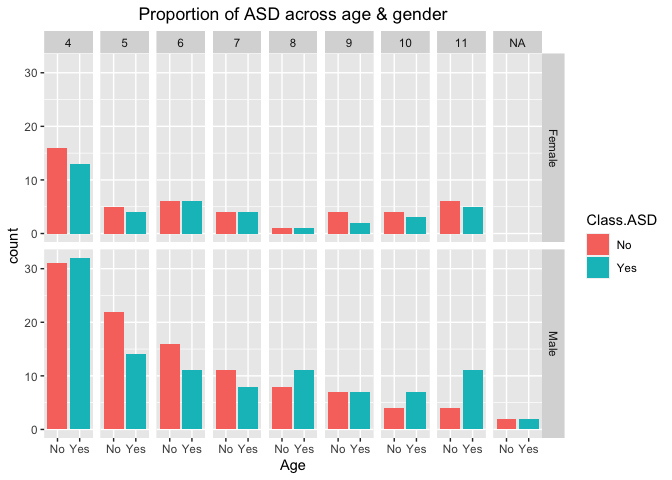<!-- -->

``` r
#2. Proportion of ASD across child with jaundice & autism
# new facet label names for Jaundice and Autism variable
jaundice.labs <- c( 'Jaundice.Yes', 'Jaundice.No')
names(jaundice.labs) <- c('Yes', 'No')

autism.labs <- c( 'Autism.Yes','Autism.No')
names(autism.labs) <- c('Yes', 'No')

ggplot(autism, aes(x = Class.ASD, fill = Class.ASD)) + geom_bar() + 
  labs(title = 'Proportion of ASD among child with jaundice & autism') +
  xlab('Class ASD') +
  theme(plot.title = element_text(hjust = 0.5)) + facet_grid(Jaundice ~ Autism, labeller = labeller(Jaundice = jaundice.labs,
                                                                                                    Autism = autism.labs))
```

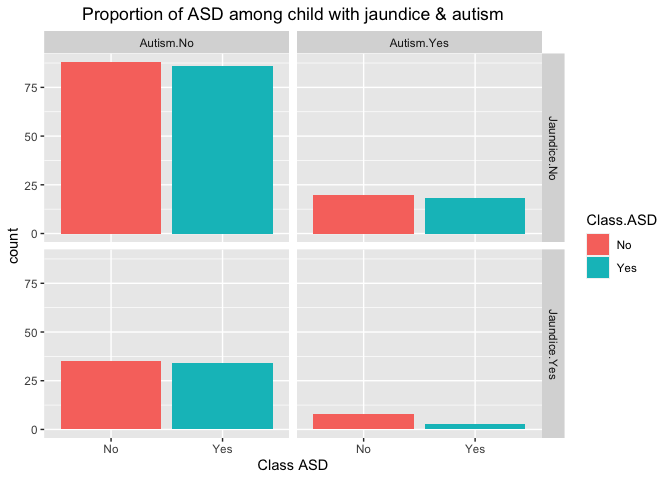<!-- -->

``` r
#3. Relationship between ethnicity and ASD
ggplot(autism, aes(x = Class.ASD,  fill = Class.ASD)) + geom_bar() +
  labs(title = "Proportion of ASD across ethnicities") +
  xlab("Ethnicity") +
  theme(plot.title = element_text(hjust = 0.5)) + facet_wrap(~ ethnicity)
```

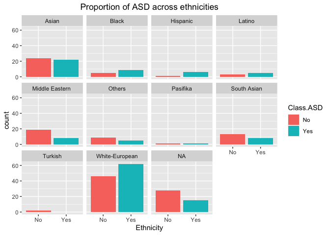<!-- -->

``` r
#4. Relationship between questionnaire and ASD
autism %>% 
  pivot_longer(A1:A10, names_to = "question", values_to = "Questionnaires") %>% 
  ggplot(aes(x = Questionnaires, fill = Class.ASD) )+
  geom_bar()+ 
  labs(title = "Proportion of ASD across different questionnaires") +
  theme(plot.title = element_text(hjust = 0.5)) +
  facet_wrap(vars(question), ncol = 5)
```

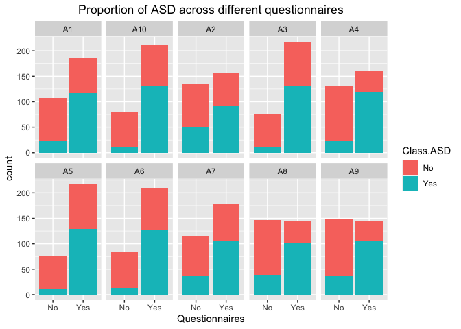<!-- -->

``` r
# Final data

# remove ethnicity
autism$ethnicity <- NULL

# imputing missing values in age
scale01 <- function(x){
  (x - min(x)) / (max(x) - min(x))
}

for (i in 1:ncol(autism)) {
  autism[is.na(autism[, i]), i] <- mean(autism[, i], na.rm = TRUE)
  
}
```

    ## Warning in mean.default(autism[, i], na.rm = TRUE): argument is not numeric or
    ## logical: returning NA

    ## Warning in mean.default(autism[, i], na.rm = TRUE): argument is not numeric or
    ## logical: returning NA

    ## Warning in mean.default(autism[, i], na.rm = TRUE): argument is not numeric or
    ## logical: returning NA

    ## Warning in mean.default(autism[, i], na.rm = TRUE): argument is not numeric or
    ## logical: returning NA

    ## Warning in mean.default(autism[, i], na.rm = TRUE): argument is not numeric or
    ## logical: returning NA

    ## Warning in mean.default(autism[, i], na.rm = TRUE): argument is not numeric or
    ## logical: returning NA

    ## Warning in mean.default(autism[, i], na.rm = TRUE): argument is not numeric or
    ## logical: returning NA

    ## Warning in mean.default(autism[, i], na.rm = TRUE): argument is not numeric or
    ## logical: returning NA

    ## Warning in mean.default(autism[, i], na.rm = TRUE): argument is not numeric or
    ## logical: returning NA

    ## Warning in mean.default(autism[, i], na.rm = TRUE): argument is not numeric or
    ## logical: returning NA

    ## Warning in mean.default(autism[, i], na.rm = TRUE): argument is not numeric or
    ## logical: returning NA

    ## Warning in mean.default(autism[, i], na.rm = TRUE): argument is not numeric or
    ## logical: returning NA

    ## Warning in mean.default(autism[, i], na.rm = TRUE): argument is not numeric or
    ## logical: returning NA

    ## Warning in mean.default(autism[, i], na.rm = TRUE): argument is not numeric or
    ## logical: returning NA

``` r
autism$age <- round(autism$age)
# print final data
names(autism)
```

    ##  [1] "A1"        "A2"        "A3"        "A4"        "A5"        "A6"       
    ##  [7] "A7"        "A8"        "A9"        "A10"       "age"       "gender"   
    ## [13] "Jaundice"  "Autism"    "Class.ASD"

``` r
dim(autism) # 292 obs. of 15 variables
```

    ## [1] 292  15

``` r
ggplot(autism, aes(x = Class.ASD,  fill = Class.ASD)) + geom_bar() +
  labs(title = "Proportion of ASD across age & gender") +
  xlab("Age") +
  theme(plot.title = element_text(hjust = 0.5)) + facet_grid(gender ~ age) 
```

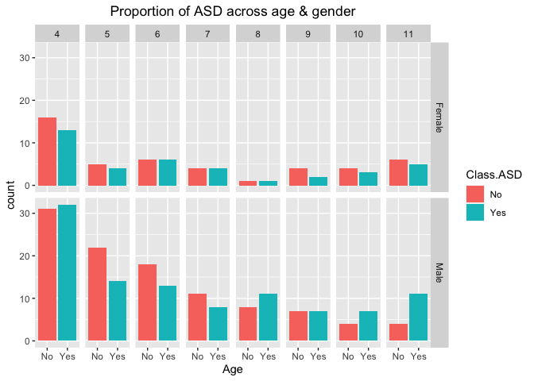<!-- -->

# Tree Based Methods

To predict the ASD in child, we first fit a classification tree to our
data set and plot it. We removed variables such as nationality,
ethnicity and relation as these did not help us much in predicting the
ASD. Rather, these variables represent the demographic information about
our participants for the ASD test.

``` r
# on all dataset
library(tree)
tree <- tree(Class.ASD ~., data = autism)
summary(tree)
```

    ## 
    ## Classification tree:
    ## tree(formula = Class.ASD ~ ., data = autism)
    ## Variables actually used in tree construction:
    ## [1] "A4"  "A9"  "A8"  "A1"  "A3"  "A2"  "A10" "A5"  "A7" 
    ## Number of terminal nodes:  19 
    ## Residual mean deviance:  0.2631 = 71.82 / 273 
    ## Misclassification error rate: 0.06164 = 18 / 292

We see that the training classification error rate is 6%. For
classification trees, the deviance is calculated using cross-entropy.

# Performance measure

In order to properly evaluate the performance of a classification tree
on these data, we first split the observations into a training set (204)
and a test set (88) and then fit the classification tree to the training
set and use the test set for evaluating the model performance.

``` r
# Reproducibility
set.seed(123)
# Splitting the data set
train_index = sample(1:nrow(autism), 204) # 70:30 ratio
autism_train = autism[train_index, ]
autism_test = autism[-train_index, ]

# building the tree using the training set and evaluating its performance on the test set
tree.autism.fit = tree(Class.ASD ~., data = autism_train)
summary(tree.autism.fit)
```

    ## 
    ## Classification tree:
    ## tree(formula = Class.ASD ~ ., data = autism_train)
    ## Variables actually used in tree construction:
    ## [1] "A4"  "A9"  "A8"  "A1"  "A10" "A5"  "A7"  "A3" 
    ## Number of terminal nodes:  13 
    ## Residual mean deviance:  0.374 = 71.43 / 191 
    ## Misclassification error rate: 0.07843 = 16 / 204

``` r
plot(tree.autism.fit); text(tree.autism.fit, pretty = 0)
title(main = "Unpruned Classification Tree")
```

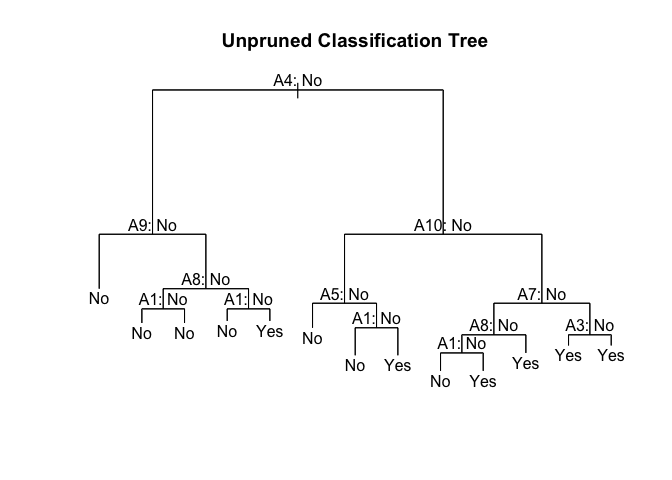<!-- -->

``` r
summary(tree.autism.fit)$used
```

    ## [1] A4  A9  A8  A1  A10 A5  A7  A3 
    ## Levels: <leaf> A1 A2 A3 A4 A5 A6 A7 A8 A9 A10 age gender Jaundice Autism

``` r
# confusion matrix on training set
tree.pred.train = predict(tree.autism.fit, autism_train, type = "class")
table(tree.pred.train,autism_train$Class.ASD)
```

    ##                
    ## tree.pred.train  No Yes
    ##             No   89   6
    ##             Yes   9 100

``` r
# Confusion matrix on test set
tree.pred = predict(tree.autism.fit, autism_test, type = "class")
table(tree.pred, autism_test$Class.ASD)
```

    ##          
    ## tree.pred No Yes
    ##       No  47   5
    ##       Yes  6  30

The percentage of correct predictions is (47 + 30)/ 88 is about 87.5%.
Or equivalently, we can automate the calculation by using the following
code:

``` r
class_table = table(tree.pred, autism_test$Class.ASD)
success_rate = (class_table[1,1] + class_table[2,2]) / sum(class_table)
success_rate
```

    ## [1] 0.875

# Pruning

We are now going to prune the tree as it might be overfitting due to it
being grown to a full depth. We use the argument FUN=prune.misclass in
order to indicate that we want the classification error rate to guide
the cross-validation and pruning process, rather than the default for
the cv.tree() function, which is deviance.And we now apply the
prune.misclass() function to prune the tree according to the results
from cv.tree().

``` r
set.seed(123)
cv.autism = cv.tree(tree.autism.fit, FUN = prune.misclass)
cv.autism
```

    ## $size
    ## [1] 13 10  7  3  2  1
    ## 
    ## $dev
    ## [1] 34 34 38 41 47 98
    ## 
    ## $k
    ## [1]      -Inf  0.000000  1.666667  3.500000 10.000000 53.000000
    ## 
    ## $method
    ## [1] "misclass"
    ## 
    ## attr(,"class")
    ## [1] "prune"         "tree.sequence"

``` r
# index of tree with minimum error
min_idx = which.min(cv.autism$dev)
min_idx
```

    ## [1] 1

``` r
# number of terminal nodes in that tree
cv.autism$size[min_idx] # 13
```

    ## [1] 13

``` r
# misclassification rate of each tree
cv.autism$dev / length(train_index)
```

    ## [1] 0.1666667 0.1666667 0.1862745 0.2009804 0.2303922 0.4803922

``` r
par(mfrow = c(1, 2))

# default plot
plot(cv.autism)

# better plot
plot(cv.autism$size, cv.autism$dev/ nrow(autism_train), 
     type = 'b', xlab = "Tree Size", ylab = "CV Misclassification Rate")
```

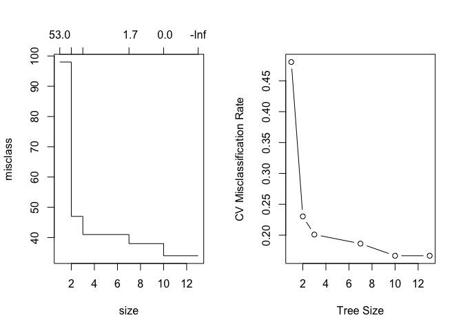<!-- -->

``` r
# pruned tree
prune.autism = prune.misclass(tree.autism.fit, best = 10)
summary(prune.autism)
```

    ## 
    ## Classification tree:
    ## snip.tree(tree = tree.autism.fit, nodes = c(10L, 11L, 15L))
    ## Variables actually used in tree construction:
    ## [1] "A4"  "A9"  "A8"  "A10" "A5"  "A1"  "A7" 
    ## Number of terminal nodes:  10 
    ## Residual mean deviance:  0.4584 = 88.92 / 194 
    ## Misclassification error rate: 0.07843 = 16 / 204

``` r
plot(prune.autism); text(prune.autism, pretty = 0)
title(main = "Prune Classification Tree")

# train
prune_tree_train_pred = predict(prune.autism, autism_train, type = "class")
table(predicted = prune_tree_train_pred, actual = autism_train$Class.ASD)
```

    ##          actual
    ## predicted  No Yes
    ##       No   87   5
    ##       Yes  11 101

``` r
# test
prune_tree_test_pred = predict(prune.autism, autism_test, type = "class")

table(predicted = prune_tree_test_pred, actual = autism_test$Class.ASD)
```

    ##          actual
    ## predicted No Yes
    ##       No  46   4
    ##       Yes  7  31

``` r
# plotting all figures
png("Rplot.png", width = 7, height = 7, res = 300, units = 'in')
par(mfrow = c(2, 2))
plot(tree.autism.fit); text(tree.autism.fit, pretty = 0)
title(main = "Unpruned Classification Tree")

plot(prune.autism); text(prune.autism, pretty = 0)
title(main = "Pruned Classification Tree")

# default plot
plot(cv.autism)

# better plot
plot(cv.autism$size, cv.autism$dev/ nrow(autism_train), 
     type = 'b', xlab = "Tree Size", ylab = "CV Misclassification Rate")
```

We are also going to evaluate this pruned tree on the test data. The
plot shows that the decision tree size = 10 has the lowest
misclassification rate, so we updated the model with this size and
obtained the success rate:

``` r
tree.pred_prune = predict(prune.autism, autism_test, type = "class")
tree.pred_prune
```

    ##  [1] No  No  Yes No  Yes No  Yes No  Yes Yes No  Yes No  No  Yes No  Yes Yes No 
    ## [20] No  No  No  Yes Yes No  No  No  No  No  No  No  Yes No  Yes Yes Yes No  Yes
    ## [39] Yes No  Yes No  Yes Yes Yes No  No  No  No  Yes No  No  No  Yes No  No  Yes
    ## [58] No  Yes No  No  Yes No  Yes Yes Yes Yes Yes Yes No  No  No  No  Yes No  No 
    ## [77] No  No  No  No  Yes No  No  Yes No  Yes Yes Yes
    ## Levels: No Yes

``` r
class_table = table(tree.pred_prune, autism_test$Class.ASD)
success_rate = (class_table[1,1] + class_table[2,2]) / sum(class_table)
success_rate
```

    ## [1] 0.875

The success rate is slightly better than the unpruned tree when using
the tree size = 10, which is 87.5%.

# Bagging

We are going to perform bagging and random forest using randomForest()
function. For bagging, the number of predictors that will be considered
for the splitting decision is equal to the total number of predictors (m
= p). Meanwhile, for random forest the number of predictors used for
splitting is usually the square root of p predictors.

``` r
library(randomForest)
```

    ## randomForest 4.6-14

    ## Type rfNews() to see new features/changes/bug fixes.

    ## 
    ## Attaching package: 'randomForest'

    ## The following object is masked from 'package:ggplot2':
    ## 
    ##     margin

``` r
set.seed(123)

# Number of bagged trees = 10
bag.autism1 = randomForest(Class.ASD ~., mtry = 14, data = autism_train, ntree = 10, importance = TRUE)
bag.autism1
```

    ## 
    ## Call:
    ##  randomForest(formula = Class.ASD ~ ., data = autism_train, mtry = 14,      ntree = 10, importance = TRUE) 
    ##                Type of random forest: classification
    ##                      Number of trees: 10
    ## No. of variables tried at each split: 14
    ## 
    ##         OOB estimate of  error rate: 14.65%
    ## Confusion matrix:
    ##     No Yes class.error
    ## No  81  16   0.1649485
    ## Yes 13  88   0.1287129

``` r
# Performance measure
pred.bag = predict(bag.autism1, newdata = autism_test)
class_table = table(pred.bag, autism_test$Class.ASD)
class_table
```

    ##         
    ## pred.bag No Yes
    ##      No  49   7
    ##      Yes  4  28

``` r
success_rate = (class_table[1,1] + class_table[2,2]) / sum(class_table)
success_rate
```

    ## [1] 0.875

The success rate for bagged tree turns out to be the same as the pruned
decision tree (87.5%).

We are now increasing the number of bootstrap trees in the bagged model
to 100 and 1000, record the test set correct prediction rate and compare
them to the bagged model with only 10 bootstrap trees. We can see that
using 100 or 1000 trees has improved the correct prediction rate, and
bagging model has a higher correct prediction rate than the pruned
decision tree.

``` r
set.seed(123)


# 100 trees
bag.autism2 = randomForest(Class.ASD ~., mtry = 14, data = autism_train, ntree = 100, importance = TRUE)
bag.autism2
```

    ## 
    ## Call:
    ##  randomForest(formula = Class.ASD ~ ., data = autism_train, mtry = 14,      ntree = 100, importance = TRUE) 
    ##                Type of random forest: classification
    ##                      Number of trees: 100
    ## No. of variables tried at each split: 14
    ## 
    ##         OOB estimate of  error rate: 10.29%
    ## Confusion matrix:
    ##     No Yes class.error
    ## No  86  12  0.12244898
    ## Yes  9  97  0.08490566

``` r
pred.bag = predict(bag.autism2, newdata = autism_test)
class_table = table(pred.bag, autism_test$Class.ASD)
class_table
```

    ##         
    ## pred.bag No Yes
    ##      No  48   4
    ##      Yes  5  31

``` r
success_rate = (class_table[1,1] + class_table[2,2]) / sum(class_table)
success_rate
```

    ## [1] 0.8977273

``` r
bag.autism2 # OOB err rate = 10.29%, accuracy rate = 89.8%
```

    ## 
    ## Call:
    ##  randomForest(formula = Class.ASD ~ ., data = autism_train, mtry = 14,      ntree = 100, importance = TRUE) 
    ##                Type of random forest: classification
    ##                      Number of trees: 100
    ## No. of variables tried at each split: 14
    ## 
    ##         OOB estimate of  error rate: 10.29%
    ## Confusion matrix:
    ##     No Yes class.error
    ## No  86  12  0.12244898
    ## Yes  9  97  0.08490566

``` r
# 1000 trees
```

``` r
bag.autism3 = randomForest(Class.ASD ~., mtry = 14, data = autism_train, ntree = 1000, importance = TRUE)
bag.autism3 
```

    ## 
    ## Call:
    ##  randomForest(formula = Class.ASD ~ ., data = autism_train, mtry = 14,      ntree = 1000, importance = TRUE) 
    ##                Type of random forest: classification
    ##                      Number of trees: 1000
    ## No. of variables tried at each split: 14
    ## 
    ##         OOB estimate of  error rate: 9.31%
    ## Confusion matrix:
    ##     No Yes class.error
    ## No  87  11   0.1122449
    ## Yes  8  98   0.0754717

``` r
pred.bag = predict(bag.autism3, newdata = autism_test)
class_table = table(pred.bag, autism_test$Class.ASD)
success_rate = (class_table[1,1] + class_table[2,2]) / sum(class_table)
success_rate
```

    ## [1] 0.9090909

``` r
bag.autism3 # OOB err rate = 9.31%, accuracy rate = 90.9%
```

    ## 
    ## Call:
    ##  randomForest(formula = Class.ASD ~ ., data = autism_train, mtry = 14,      ntree = 1000, importance = TRUE) 
    ##                Type of random forest: classification
    ##                      Number of trees: 1000
    ## No. of variables tried at each split: 14
    ## 
    ##         OOB estimate of  error rate: 9.31%
    ## Confusion matrix:
    ##     No Yes class.error
    ## No  87  11   0.1122449
    ## Yes  8  98   0.0754717

\#layout(matrix(c(1,2,3,3, 3, 2), 2, 2, byrow = TRUE))

``` r
par(mfrow = c(2, 2))

plot(bag.autism1$err.rate[, 1], col = "dodgerblue", lwd = 2, main = "Bagged Trees: Error vs 10 Trees", type = "l", ylab = "Out of Bag Error",
     xlab = 'Trees')
text(4, 0.21, "Error rate: 14.65%")
grid()

plot(bag.autism2$err.rate[, 1], col = "dodgerblue", lwd = 2, main = "Bagged Trees: Error vs 100 Trees", type = "l", ylab = "Out of Bag Error",
     xlab = 'Trees')
text(40, 0.21, "Error rate: 10.29%")
grid()

plot(bag.autism3$err.rate[, 1], col = "dodgerblue", lwd = 2, main = "Bagged Trees: Error vs 1000 Trees", type = "l", ylab = "Out of Bag Error",
     xlab = 'Trees')
text(400, 0.14, "Error rate: 9.31%")
grid()

varImpPlot(bag.autism3, type = 1, main  = 
             "Variable Importance (1000 trees)")
```

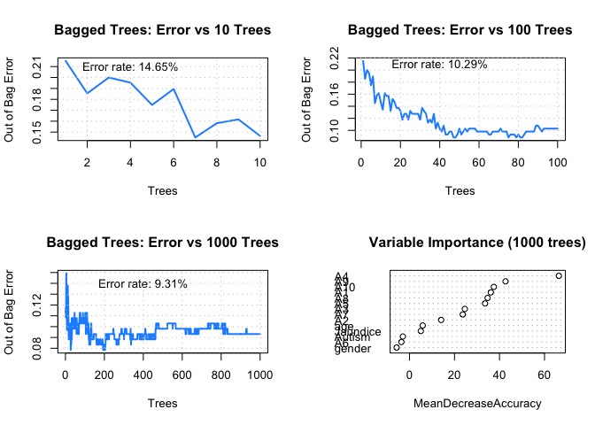<!-- --> \#
cross-validation

``` r
library(caret)
```

    ## Loading required package: lattice

``` r
tree_bag2 <- train(
  Class.ASD ~ .,
  data = autism_train,
  method = "treebag",
  trControl = trainControl(method = "cv", number = 5),
  nbagg = 1000  
  
)
tree_bag2
```

    ## Bagged CART 
    ## 
    ## 204 samples
    ##  14 predictor
    ##   2 classes: 'No', 'Yes' 
    ## 
    ## No pre-processing
    ## Resampling: Cross-Validated (5 fold) 
    ## Summary of sample sizes: 163, 164, 164, 163, 162 
    ## Resampling results:
    ## 
    ##   Accuracy   Kappa    
    ##   0.9125203  0.8244745

The success rate for the models with 100 and 1000 bagged trees is
definitely higher than that of with only 10 trees.The model with 1000
bagged trees has the highest accuracy rate. We can also see that the out
of bag error rate decreases when we’re increasing the number of bagged
trees but starts to increase again.

# Random Forests

We are now growing a random forest in exactly the same way, except that
we use a smaller value of the mtry argument. We are using sqrt(p), which
is 4:

``` r
set.seed(123) # by deafult, 500 trees, error rate = 6.86
rf.autism = randomForest(Class.ASD ~., mtry = 4, data = autism_train, importance = TRUE)
pred.rf = predict(rf.autism, newdata = autism_test)
class_table = table(pred.rf, autism_test$Class.ASD)
success_rate = (class_table[1,1] + class_table[2,2]) / sum(class_table)
success_rate
```

    ## [1] 0.9318182

``` r
plot(rf.autism)
```

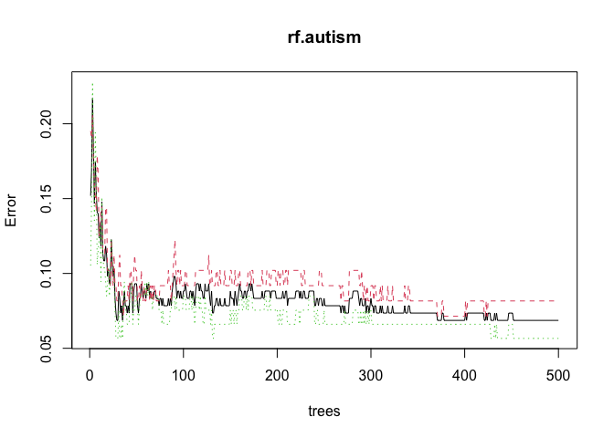<!-- --> The
success rate for the random forest model with 500 trees is 93.2%, which
is slightly higher than the bagged model with 1000 trees, which makes
sense as random forest splits the variable based on the significance.

We are also going to use the importance() function to view the
importance of each variable.

# Plotting error rate for RF model

``` r
oob.err.data <- data.frame(
  Trees = rep(1:nrow(rf.autism$err.rate), 3), 
  Type = rep(c("OOB","No","Yes"), each = nrow(rf.autism$err.rate)),
  Error = c(rf.autism$err.rate[,"OOB"], rf.autism$err.rate[,"No"], rf.autism$err.rate[,"Yes"]))

ggplot(data = oob.err.data, aes(x = Trees, y = Error))+ geom_line(aes(color = Type))
```

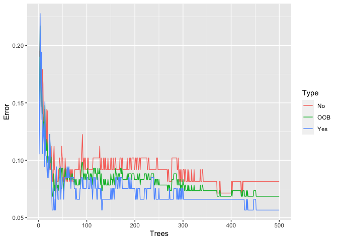<!-- -->

``` r
# split the training set further for validation
set.seed(123)
library(rsample)
valid_split <- initial_split(autism_train, .8)

# training data
autism_train_v2 <- analysis(valid_split)

# validation data
autism_valid <- assessment(valid_split)
x_test <- autism_valid[setdiff(names(autism_valid), "Class.ASD")]
y_test <- autism_valid$Class.ASD

rf_oob_comp <- randomForest(
  formula = Class.ASD ~.,
  data = autism_train_v2,
  xtest = x_test,
  ytest = y_test
)

# extract OOB & validation errors
oob <- rf_oob_comp$err.rate
validation <- rf_oob_comp$test$err.rate

# compare  error rates


trees <- tibble::tibble(
  `Out of Bag Error` = oob,
  `Test error` = validation,
  ntrees = 1:rf_oob_comp$ntree
) %>% 
  gather(metric, oob.err, -ntrees) %>% 
  ggplot(aes(ntrees, oob.err, color = metric)) +
  geom_line()+
  xlab("Number of Trees") + ylab("Error")
```

    ## Warning: attributes are not identical across measure variables;
    ## they will be dropped

We’re going to write a “for” loop to record the true prediction rate for
14 possible values of “mtry”. \# Using 1000 RF trees

``` r
set.seed(123)
rf.autism = randomForest(Class.ASD ~., mtry = 2, ntree = 1000, data = autism_train, importance = TRUE)
oob.err.data <- data.frame(
  Trees = rep(1:nrow(rf.autism$err.rate), 3), 
  Type = rep(c("OOB"), each = nrow(rf.autism$err.rate)),
  Error = c(rf.autism$err.rate[,"OOB"]))

ggplot(data = oob.err.data, aes(x = Trees, y = Error))+ geom_line(aes(color = Type))
```

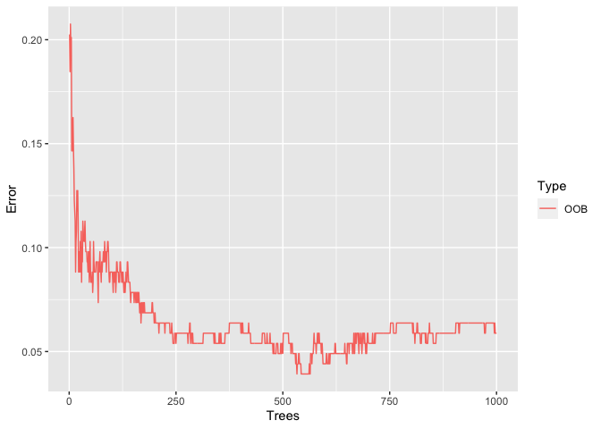<!-- --> So,
we’re going to use 1000 trees but now we’re going to vary the mtry
values:

``` r
set.seed(123)
oob.err = matrix(NA, nrow = 14, ncol = 1,
                      dimnames = list(NULL, c("OOB error rate")))
for (i in 1:14) {
  fit = randomForest(Class.ASD ~., 
                     data = autism_train, mtry = i, ntree = 1000)
  oob.err[i] = fit$err.rate[nrow(fit$err.rate), 1]
}
oob.err
```

    ##       OOB error rate
    ##  [1,]     0.07352941
    ##  [2,]     0.05392157
    ##  [3,]     0.06862745
    ##  [4,]     0.07352941
    ##  [5,]     0.06862745
    ##  [6,]     0.06862745
    ##  [7,]     0.07352941
    ##  [8,]     0.07843137
    ##  [9,]     0.07843137
    ## [10,]     0.08823529
    ## [11,]     0.09313725
    ## [12,]     0.08823529
    ## [13,]     0.09313725
    ## [14,]     0.09803922

``` r
oob.err <- data.frame(oob.err, mtry = c(1:14))
err.rate.plot <- ggplot(data = oob.err, aes( x = mtry, y = OOB.error.rate))+ 
  geom_line() +
  geom_point() +
  geom_vline(xintercept = which.min(oob.err$OOB.error.rate), linetype = 'dashed',
             colour = 'red', size = 0.5) +
  geom_text(aes(x = 2.3, label = 'mtry = 2', y = 0.08) , colour = 'blue', angle = 90)

err.rate.plot
```

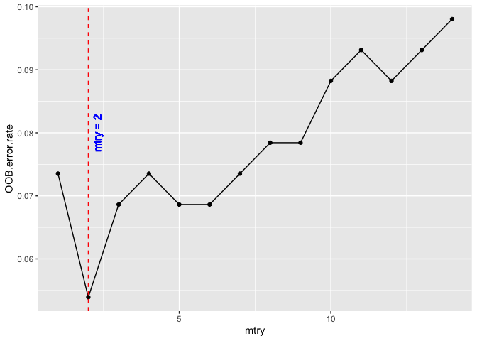<!-- -->

``` r
ggsave('rferr-rate.png')  
```

    ## Saving 7 x 5 in image

# Final RF model

``` r
set.seed(123)
# Updating mtry value
rf.autism2 = randomForest(Class.ASD ~., mtry = 2, data = autism_train, ntree = 1000, importance = TRUE)

# Performance measure
pred.rf = predict(rf.autism2, newdata = autism_test)
class_table = table(pred.rf, autism_test$Class.ASD)
success_rate = (class_table[1,1] + class_table[2,2]) / sum(class_table)
success_rate
```

    ## [1] 0.9659091

The success rate is quite varied across different numbers of predictors
considered at each split of a tree, but mtry = 2 is notably having the
smallest error rate. We updated the mtry value to the random forest
model and recorded its success rate (96.6%)

We’re also going to check the variable importance for this random forest
model. We can see that A4 has the highest value for the Mean Gini
Decrease.

# Tuning Random Forest with Caret

One approach is to create many caret models for our algorithm and pass
in a different parameters directly to the algorithm manually. Let’s look
at an example doing this to evaluate different values for ntree while
holding mtry constant

``` r
library(caret)
seed = 7
metric = "Accuracy"
control <- trainControl(method="repeatedcv", number=5, repeats=3, search="grid") # 5 folds repeat 3 times
tunegrid <- expand.grid(.mtry= 2)
modellist <- list()

for (ntree in c(10, 100, 1000)) {
    set.seed(seed)
    fit <- train(Class.ASD~., data=autism_train, method="rf", metric=metric, tuneGrid=tunegrid, trControl=control, ntree=ntree)
    key <- toString(ntree)
    modellist[[key]] <- fit
}
# compare results
results <- resamples(modellist)
summary(results)
```

    ## 
    ## Call:
    ## summary.resamples(object = results)
    ## 
    ## Models: 10, 100, 1000 
    ## Number of resamples: 15 
    ## 
    ## Accuracy 
    ##           Min.   1st Qu.    Median      Mean   3rd Qu.      Max. NA's
    ## 10   0.8048780 0.8750000 0.8809524 0.8855536 0.9024390 0.9756098    0
    ## 100  0.8536585 0.9012195 0.9500000 0.9311711 0.9523810 1.0000000    0
    ## 1000 0.8750000 0.9137195 0.9268293 0.9344619 0.9518002 1.0000000    0
    ## 
    ## Kappa 
    ##           Min.   1st Qu.    Median      Mean   3rd Qu.      Max. NA's
    ## 10   0.6095238 0.7487437 0.7619048 0.7704433 0.8045289 0.9511323    0
    ## 100  0.7071429 0.8016253 0.9002494 0.8619457 0.9045435 1.0000000    0
    ## 1000 0.7487437 0.8272359 0.8540925 0.8686515 0.9032453 1.0000000    0

``` r
dotplot(results)
```

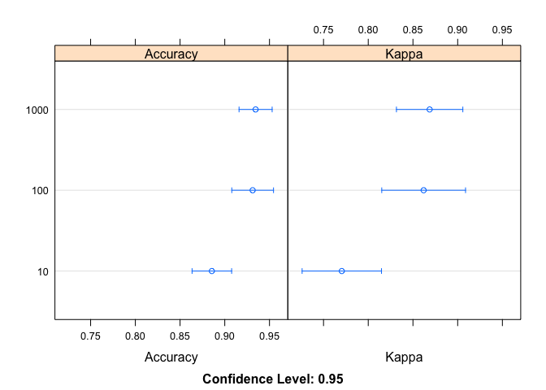<!-- -->

``` r
png("dotplot.png")
par(mfrow = c(1, 1))
 tibble::tibble(
  `Out of Bag Error` = oob,
  `Test error` = validation,
  ntrees = 1:rf_oob_comp$ntree
) %>% 
  gather(metric, oob.err, -ntrees) %>% 
  ggplot(aes(ntrees, oob.err, color = metric)) +
  geom_line()+
  xlab("Number of Trees") + ylab("Error") 
```

    ## Warning: attributes are not identical across measure variables;
    ## they will be dropped

``` r
dev.off()
```

    ## quartz_off_screen 
    ##                 2

We can see that the most accuracy value for ntree was perhaps 1,000
trees with a mean accuracy of 93.3%, quite consistent with the above
method.

``` r
library("ranger")
```

    ## 
    ## Attaching package: 'ranger'

    ## The following object is masked from 'package:randomForest':
    ## 
    ##     importance

``` r
hyper_grid_rf <- expand.grid(
  mtry       = seq(2, 14, by = 1),
  node_size  = seq(3, 14, by = 2),
  sampe_size = c(.55, .632, .70, .80),
  replace = c(TRUE, FALSE),
  OOB_err   = 0
)

# total number of combinations
nrow(hyper_grid_rf)
```

    ## [1] 624

``` r
for(i in 1:nrow(hyper_grid_rf)) {
  
  # train model
  model <- ranger(
    formula         = Class.ASD ~ ., 
    data            = autism_train, 
    num.trees       = 500,
    replace = hyper_grid_rf$replace[i],
    mtry            = hyper_grid_rf$mtry[i],
    min.node.size   = hyper_grid_rf$node_size[i],
    sample.fraction = hyper_grid_rf$sampe_size[i],
    seed            = 123
  )
  
  # add OOB error to grid
  hyper_grid_rf$OOB_err[i] <- model$prediction.error
}

hyper_grid_rf %>% 
  dplyr::arrange(OOB_err) %>%
  head(10)
```

    ##    mtry node_size sampe_size replace    OOB_err
    ## 1     2         3      0.700    TRUE 0.03431373
    ## 2     2         3      0.550    TRUE 0.03921569
    ## 3     2         9      0.550    TRUE 0.04411765
    ## 4     2        11      0.632    TRUE 0.04411765
    ## 5     2         5      0.700    TRUE 0.04411765
    ## 6     2         3      0.800    TRUE 0.04411765
    ## 7     2         7      0.800    TRUE 0.04411765
    ## 8     2        13      0.800    TRUE 0.04411765
    ## 9     2         3      0.550   FALSE 0.04411765
    ## 10    2         5      0.550   FALSE 0.04411765

``` r
# optimal model according to Ranger hyperparameter grid search

OOB_err <- vector(mode = 'numeric', length = 100)

for (i in seq_along(OOB_err)) {
  
  optimal_ranger <- ranger(
    formula = Class.ASD ~ .,
    data = autism_train,
    num.trees = 500,
    replace = TRUE,
    mtry = 2,
    sample.fraction = .7,
    importance = 'impurity',
    
  )
  
  OOB_err[i] <- sqrt(optimal_ranger$prediction.error)
}

hist(OOB_err)
```

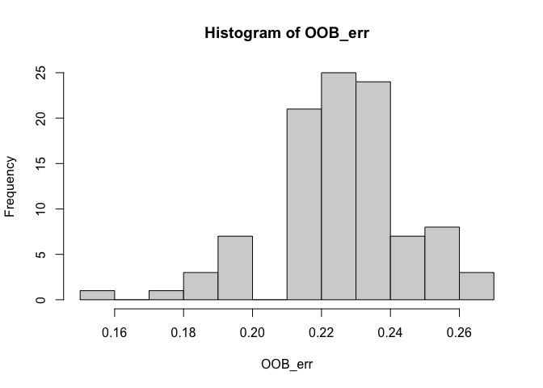<!-- -->

``` r
# variable importance
library(tidyverse)
```

    ## ── Attaching packages ─────────────────────────────────────── tidyverse 1.3.1 ──

    ## ✓ tibble  3.1.2     ✓ dplyr   1.0.8
    ## ✓ readr   2.1.2     ✓ stringr 1.4.0
    ## ✓ purrr   0.3.4     ✓ forcats 0.5.1

    ## Warning: package 'readr' was built under R version 4.1.2

    ## Warning: package 'dplyr' was built under R version 4.1.2

    ## ── Conflicts ────────────────────────────────────────── tidyverse_conflicts() ──
    ## x dplyr::combine()       masks randomForest::combine()
    ## x dplyr::filter()        masks stats::filter()
    ## x dplyr::lag()           masks stats::lag()
    ## x purrr::lift()          masks caret::lift()
    ## x randomForest::margin() masks ggplot2::margin()

``` r
topvars <- optimal_ranger$variable.importance %>% 
  tidy() %>% 
  dplyr::arrange(desc(x)) %>% 
  dplyr::top_n(14) %>% 
  ggplot(aes(reorder(names, x), x, fill = x)) + ylab("Mean Decrease in  Accuracy (MDA)") + labs(fill = "MDA") +
  xlab("Variables") +
  geom_col() +
  coord_flip() +
  ggtitle("Top 14 important variables")
```

    ## Warning: 'tidy.numeric' is deprecated.
    ## See help("Deprecated")

    ## Warning: `data_frame()` was deprecated in tibble 1.1.0.
    ## Please use `tibble()` instead.

    ## Selecting by x

``` r
topvars
```

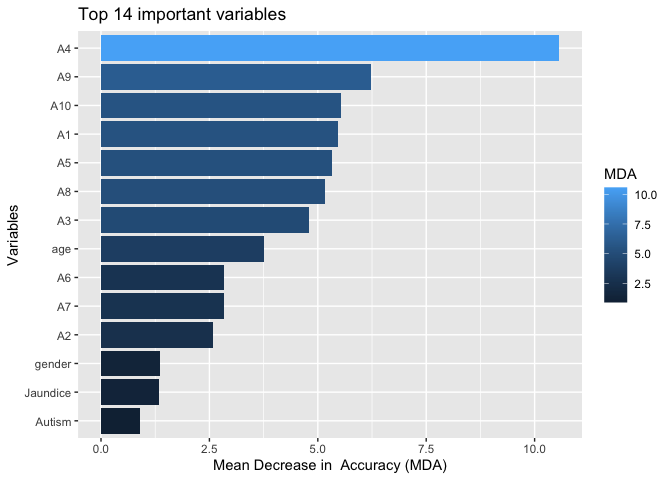<!-- -->

``` r
ggplot2::ggsave("topvars.png")
```

    ## Saving 7 x 5 in image

``` r
rf_permutation <- ranger(
  formula = Class.ASD ~ ., 
  data = autism_train, 
  num.trees = 500,
  mtry = 2,
  min.node.size = 3,
  sample.fraction = .70,
  replace = TRUE,
  importance = "permutation",
  respect.unordered.factors = "order",
  verbose = FALSE,
  seed  = 123
)

topvars2 <- rf_permutation$variable.importance %>% 
  tidy() %>% 
  dplyr::arrange(desc(x)) %>% 
  dplyr::top_n(14) %>% 
  ggplot(aes(reorder(names, x), x, fill = x)) + ylab("Permutation (MDA)") + labs(fill = "MDA") +
  xlab("Variables") +
  geom_col() +
  coord_flip() +
  ggtitle("Top 14 important variables")
```

    ## Warning: 'tidy.numeric' is deprecated.
    ## See help("Deprecated")

    ## Selecting by x

``` r
topvars2
```

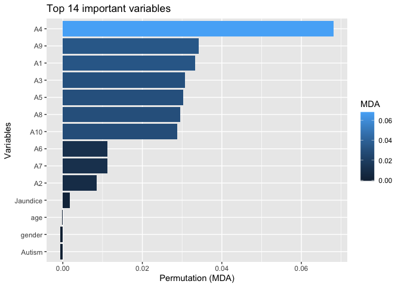<!-- -->

``` r
# prediction
library(caret)
fit_rf <- train(Class.ASD ~.,
                autism_train,
                method = 'rf',
                metric = 'Accuracy',
                nodesize = 2,
                importance = TRUE, 
                ntree = 500)
summary(fit_rf)
```

    ##                 Length Class      Mode     
    ## call               7   -none-     call     
    ## type               1   -none-     character
    ## predicted        204   factor     numeric  
    ## err.rate        1500   -none-     numeric  
    ## confusion          6   -none-     numeric  
    ## votes            408   matrix     numeric  
    ## oob.times        204   -none-     numeric  
    ## classes            2   -none-     character
    ## importance        56   -none-     numeric  
    ## importanceSD      42   -none-     numeric  
    ## localImportance    0   -none-     NULL     
    ## proximity          0   -none-     NULL     
    ## ntree              1   -none-     numeric  
    ## mtry               1   -none-     numeric  
    ## forest            14   -none-     list     
    ## y                204   factor     numeric  
    ## test               0   -none-     NULL     
    ## inbag              0   -none-     NULL     
    ## xNames            14   -none-     character
    ## problemType        1   -none-     character
    ## tuneValue          1   data.frame list     
    ## obsLevels          2   -none-     character
    ## param              3   -none-     list

``` r
pred_randomForest <- predict(fit_rf, autism_test)
head(pred_randomForest)
```

    ## [1] No  No  Yes No  Yes No 
    ## Levels: No Yes

``` r
library(vip)
```

    ## 
    ## Attaching package: 'vip'

    ## The following object is masked from 'package:utils':
    ## 
    ##     vi

``` r
p2 <- vip::vip(rf_permutation, num_features = 14, bar = TRUE)
p2
```

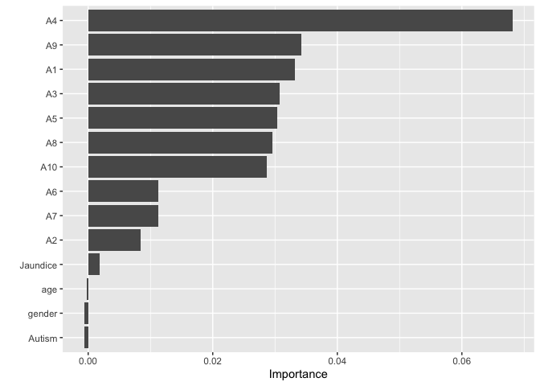<!-- -->

``` r
# performance

confusionMatrix(pred_randomForest, autism_test$Class.ASD)
```

    ## Confusion Matrix and Statistics
    ## 
    ##           Reference
    ## Prediction No Yes
    ##        No  50   0
    ##        Yes  3  35
    ##                                           
    ##                Accuracy : 0.9659          
    ##                  95% CI : (0.9036, 0.9929)
    ##     No Information Rate : 0.6023          
    ##     P-Value [Acc > NIR] : 1.395e-15       
    ##                                           
    ##                   Kappa : 0.9299          
    ##                                           
    ##  Mcnemar's Test P-Value : 0.2482          
    ##                                           
    ##             Sensitivity : 0.9434          
    ##             Specificity : 1.0000          
    ##          Pos Pred Value : 1.0000          
    ##          Neg Pred Value : 0.9211          
    ##              Prevalence : 0.6023          
    ##          Detection Rate : 0.5682          
    ##    Detection Prevalence : 0.5682          
    ##       Balanced Accuracy : 0.9717          
    ##                                           
    ##        'Positive' Class : No              
    ## 

# Boosting

``` r
library(gbm)
```

    ## Loaded gbm 2.1.8

``` r
set.seed(060222)
boost.autism = gbm((unclass(Class.ASD)-1) ~ ., data = autism_train, distribution = "bernoulli", n.trees = 1000, interaction.depth = 1, shrinkage = 0.001, cv.folds = 5)
summary(boost.autism)
```

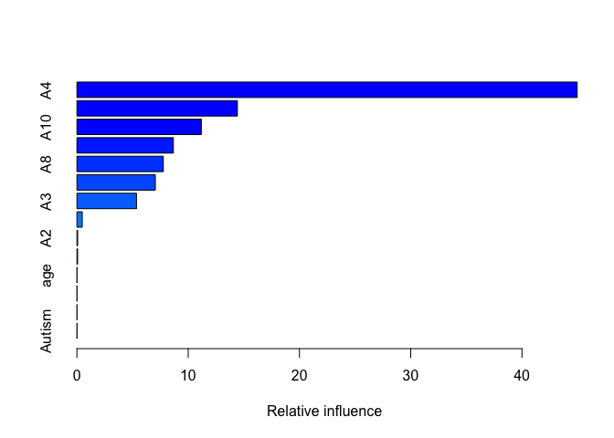<!-- -->

    ##               var     rel.inf
    ## A4             A4 44.95895746
    ## A9             A9 14.42318006
    ## A10           A10 11.17946111
    ## A5             A5  8.66677059
    ## A8             A8  7.76475113
    ## A1             A1  7.04744939
    ## A3             A3  5.35278613
    ## A6             A6  0.47864046
    ## A2             A2  0.06467751
    ## A7             A7  0.06332617
    ## age           age  0.00000000
    ## gender     gender  0.00000000
    ## Jaundice Jaundice  0.00000000
    ## Autism     Autism  0.00000000

``` r
print(boost.autism)
```

    ## gbm(formula = (unclass(Class.ASD) - 1) ~ ., distribution = "bernoulli", 
    ##     data = autism_train, n.trees = 1000, interaction.depth = 1, 
    ##     shrinkage = 0.001, cv.folds = 5)
    ## A gradient boosted model with bernoulli loss function.
    ## 1000 iterations were performed.
    ## The best cross-validation iteration was 1000.
    ## There were 14 predictors of which 10 had non-zero influence.

``` r
which.min(boost.autism$cv.error)
```

    ## [1] 1000

``` r
gbm.perf(boost.autism, method = "cv")
```

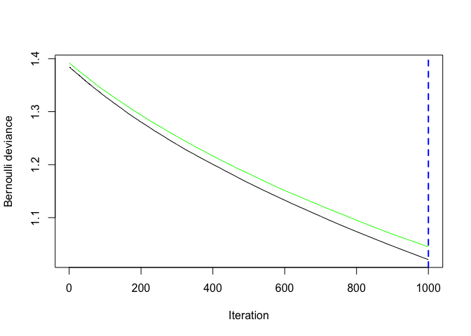<!-- -->

    ## [1] 1000

We’re now going to use the boosted model to predict autism on the test
set, and record the success rate. We compare this value with the random
forest model built earlier:

``` r
pred.boost = predict(boost.autism, newdata = autism_test, n.trees = 1000, type = "response")
autism_pred = ifelse(pred.boost <= 0.5, "No", "Yes")
class_table = table(autism_pred, autism_test$Class.ASD)
success_rate = (class_table[1,1] + class_table[2,2]) / sum(class_table)
success_rate
```

    ## [1] 0.8295455

It turns out that success rate for boosted model with default parameters
is lower than the random forest. Let’s tune our parameters

# Tuning boosted model

``` r
set.seed(060222)
# increasing interaction depth and learning rate
boost.autism2 = gbm((unclass(Class.ASD)-1) ~ ., data = autism_train, distribution = "bernoulli", n.trees = 5000, interaction.depth = 3, shrinkage = 0.1, cv.folds = 5)
summary(boost.autism2)
```

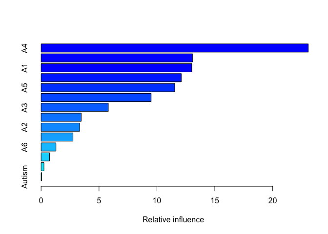<!-- -->

    ##               var     rel.inf
    ## A4             A4 23.07735776
    ## A10           A10 13.07126036
    ## A1             A1 13.01745020
    ## A9             A9 12.10670756
    ## A5             A5 11.53843490
    ## A8             A8  9.50521279
    ## A3             A3  5.80674294
    ## A7             A7  3.46974488
    ## A2             A2  3.32977353
    ## age           age  2.75701797
    ## A6             A6  1.28682796
    ## Jaundice Jaundice  0.72843135
    ## gender     gender  0.24816868
    ## Autism     Autism  0.05686911

``` r
pred.boost2 = predict(boost.autism2, newdata = autism_test, n.trees = 5000, type = "response")
autism_pred2 = ifelse(pred.boost <= 0.5, "No", "Yes")
class_table = table(autism_pred, autism_test$Class.ASD)
success_rate = (class_table[1,1] + class_table[2,2]) / sum(class_table)
success_rate
```

    ## [1] 0.8295455

``` r
# plot loss function as a result of n trees added to the ensemble
set.seed(060222)
gbm.perf(boost.autism2, method = "cv")
```

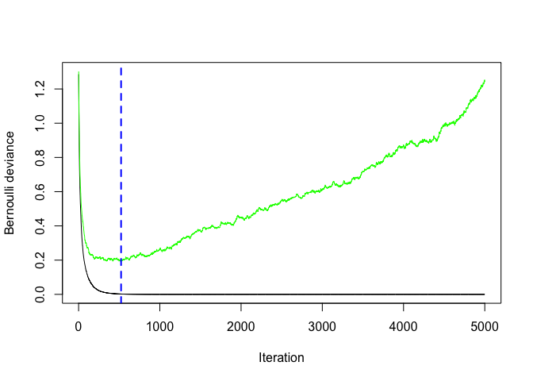<!-- -->

    ## [1] 523

Using an interaction depth = 3 and learning rate = 0.1 has significantly
increased the success rate to 98.4% in comparison to using an
interaction depth = 1. Moreover, the gbm.per() returns the optimal
number of iterations using cross-validation. In this case, it seems that
n.trees = is the optimal number of iteration. Let’s try to update the
model with the same metrics as above except that n.trees argument now is
100:

``` r
set.seed(060222)
# increasing interaction depth and learning rate
boost.autism3 = gbm((unclass(Class.ASD)-1) ~ ., data = autism_train, distribution = "bernoulli", n.trees = 1000, interaction.depth = 2, shrinkage = 0.1, cv.folds = 5)
summary(boost.autism3)
```

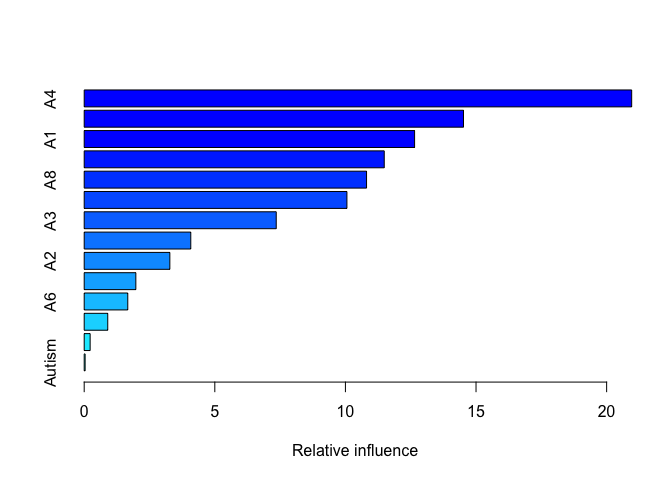<!-- -->

    ##               var     rel.inf
    ## A4             A4 20.95874982
    ## A10           A10 14.52034182
    ## A1             A1 12.64816984
    ## A9             A9 11.48614860
    ## A8             A8 10.80887076
    ## A5             A5 10.05752882
    ## A3             A3  7.35120364
    ## A7             A7  4.08030332
    ## A2             A2  3.27875220
    ## age           age  1.97717444
    ## A6             A6  1.66836554
    ## Jaundice Jaundice  0.90171593
    ## gender     gender  0.22752456
    ## Autism     Autism  0.03515072

``` r
pred.boost3 = predict(boost.autism3, newdata = autism_test, n.trees = 1000, type = "response")
autism_pred3 = ifelse(pred.boost3 <= 0.5, "No", "Yes")
class_table = table(autism_pred3, autism_test$Class.ASD)
success_rate = (class_table[1,1] + class_table[2,2]) / sum(class_table)
success_rate
```

    ## [1] 1

With the learning rate = 0.1, interaction depth = 2, and the number of
iterations = 1000, we obtain the same success rate 98.4%.

# Grid Search

However, a better option than manually tweaking hyperparameters one at a
time is to perform a grid search which iterates over every combination
of hyperparameter values and allows us to assess which combination tends
to perform well. To perform a manual grid search, first we want to
construct our grid of hyperparameter combinations. We’re going to search
across 81 models with varying learning rates and tree depth. I also vary
the minimum number of observations allowed in the trees terminal nodes
(n.minobsinnode) and introduce stochastic gradient descent by allowing
bag.fraction &lt; 1.

``` r
hyper_grid <- expand.grid(
  shrinkage = c(.01, .1, .3),
  interaction.depth = c(1, 3, 5),
  n.minobsinnode = c(5, 10, 15),
  bag.fraction = c(.65, .8, 1), 
  optimal_trees = 0,               # a place to dump results
  min_cv = 0                     # a place to dump results
)
nrow(hyper_grid)
```

    ## [1] 81

We loop through each hyperparameter combination and apply 1,000 trees.

``` r
# grid search
for (i in 1:nrow(hyper_grid)) {
  
  # reproducibility
  set.seed(070222)
  
  # train model
  gbm.tune <- gbm((unclass(Class.ASD)-1) ~ ., data = autism_train,
                  distribution = "bernoulli",
                  n.trees = 400,
                  interaction.depth = hyper_grid$interaction.depth[i],
                  shrinkage = hyper_grid$shrinkage[i],
                  n.minobsinnode = hyper_grid$n.minobsinnode[i],
                  bag.fraction = hyper_grid$bag.fraction[i],
                  train.fraction = .75,
                  n.cores = NULL,
                  verbose = FALSE
  )
  # add min training error and trees to grid
  hyper_grid$optimal_trees[i] <- which.min(gbm.tune$valid.error)
  hyper_grid$min_cv[i] <- min(gbm.tune$valid.error)
}

hyper_grid %>% 
  dplyr::arrange(min_cv) %>% 
  head(10)
```

    ##    shrinkage interaction.depth n.minobsinnode bag.fraction optimal_trees
    ## 1        0.3                 1              5         0.65           398
    ## 2        0.3                 1             10         0.65           398
    ## 3        0.3                 1             15         0.65           359
    ## 4        0.3                 1             15         0.80           398
    ## 5        0.3                 1              5         0.80           387
    ## 6        0.3                 1             10         0.80           387
    ## 7        0.3                 1              5         1.00           391
    ## 8        0.3                 1             10         1.00           391
    ## 9        0.3                 1             15         1.00           391
    ## 10       0.1                 1              5         0.65           398
    ##        min_cv
    ## 1  0.02118359
    ## 2  0.02118359
    ## 3  0.02392145
    ## 4  0.03350383
    ## 5  0.04021165
    ## 6  0.04021165
    ## 7  0.10337662
    ## 8  0.10337662
    ## 9  0.10337662
    ## 10 0.16645152

# Training final boosted model

``` r
set.seed(070222)

gbm.fit.final <- gbm(
  (unclass(Class.ASD)-1) ~ .,
  distribution = "bernoulli",
  data = autism_train,
  n.trees = 398,
  interaction.depth = 1,
  n.minobsinnode = 5,
  shrinkage = 0.3,
  bag.fraction = 0.65,
  n.cores = NULL,
  verbose = FALSE
)

# Performance measure
pred.gbm = predict(gbm.fit.final, newdata = autism_test, n.trees = 398, type = "response")
pred.gbm.final = ifelse(pred.gbm <= 0.5, "No", "Yes")
class_table = table(pred.gbm.final, autism_test$Class.ASD)
success_rate = (class_table[1,1] + class_table[2,2]) / sum(class_table)
success_rate
```

    ## [1] 1

``` r
class_table
```

    ##               
    ## pred.gbm.final No Yes
    ##            No  53   0
    ##            Yes  0  35

``` r
# Visualising the feature importance
par(mar = c(5, 8, 1, 1))
summary(
  gbm.fit.final, 
  cBars = 10,
  method = relative.influence, # also can use permutation.test.gbm
  las = 2
  )
```

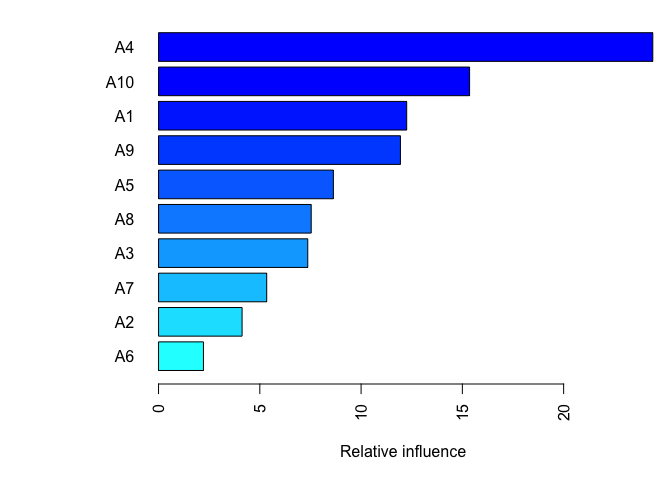<!-- -->

    ##               var      rel.inf
    ## A4             A4 24.402238763
    ## A10           A10 15.356770979
    ## A1             A1 12.251441648
    ## A9             A9 11.941852303
    ## A5             A5  8.631670330
    ## A8             A8  7.536646229
    ## A3             A3  7.366642888
    ## A7             A7  5.340138789
    ## A2             A2  4.124098090
    ## A6             A6  2.216675687
    ## age           age  0.545498103
    ## Jaundice Jaundice  0.253591821
    ## gender     gender  0.026497876
    ## Autism     Autism  0.006236495
